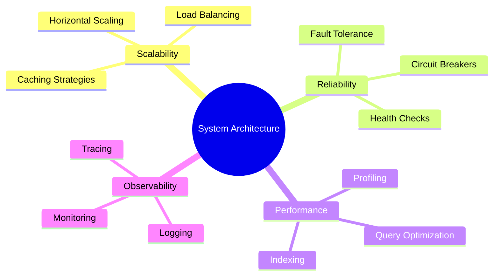

# 🏛️ System Architect Aspirant | Şevval CANDAN

<div align="center">


</div>

> *"Engineering is not just about solving problems; it's about architecting systems where problems are minimized by design."*

---

## 👨‍💻 About Me

```python
class SystemArchitect:
    def __init__(self):
        self.name = "Şevval CANDAN"
        self.role = "Computer Engineering Student"
        self.location = "Turkey 🇹🇷"
        self.passions = [
            "Distributed Systems",
            "Machine Learning Engineering",
            "Cloud Architecture",
            "System Design Patterns"
        ]
    
    def get_current_focus(self):
        return {
            "learning": ["Kubernetes", "Microservices", "Event-Driven Architecture"],
            "reading": "Designing Data-Intensive Applications - Martin Kleppmann",
            "building": "Scalable ML Inference Pipelines"
        }
```

---

## 🛠️ Technology Stack

<div align="center">

### 💻 Languages


### 🤖 AI/ML & Data Science


### 🔧 DevOps & Cloud


### 💾 Databases


</div>

---

## 📊 GitHub Statistics

<div align="center">

<!-- GitHub Stats Card -->


<!-- Top Languages Card -->


</div>

<div align="center">

<!-- GitHub Streak Stats -->


</div>

<div align="center">

<!-- Activity Graph -->


</div>

<div align="center">

<!-- GitHub Trophies -->


</div>

---

## 🎯 Current Sprint: Q1 2026

<div align="center">

| 🔍 Focus | 📚 Learning | 🏗️ Building |
|:--------:|:-----------:|:-----------:|
| Distributed Systems | Kubernetes Orchestration | Microservices Architecture |
| System Design | Event-Driven Patterns | ML Pipeline Optimization |
| Cloud Native | Service Mesh (Istio) | Container Infrastructure |

</div>

### 🚀 Learning Roadmap



---

## 🏆 Core Competencies

<div align="center">

### 💡 Technical Skills Matrix

| Domain | Technologies | Proficiency |
|:------:|:------------|:-----------:|
| **Backend Development** | Python, Java, REST APIs | ⭐⭐⭐⭐⭐ |
| **Machine Learning** | PyTorch, TensorFlow, Scikit-learn | ⭐⭐⭐⭐⭐ |
| **DevOps & Cloud** | Docker, Kubernetes, AWS | ⭐⭐⭐⭐ |
| **Databases** | PostgreSQL, MongoDB, Redis | ⭐⭐⭐⭐ |
| **System Design** | Distributed Systems, Microservices | ⭐⭐⭐⭐ |

</div>

---

## 💼 What I'm Working On

### 🔥 Current Projects

- 🤖 **ML Pipeline Infrastructure** - Building scalable model serving systems
- 🏗️ **Microservices Platform** - Implementing CQRS and Event Sourcing patterns
- 📊 **Data Engineering** - Real-time ETL pipelines with Apache Kafka
- ☁️ **Cloud Architecture** - Multi-region Kubernetes deployments

### 📖 Reading List

- 📕 *Designing Data-Intensive Applications* - Martin Kleppmann
- 📗 *System Design Interview* - Alex Xu
- 📘 *Clean Architecture* - Robert C. Martin
- 📙 *Kubernetes in Action* - Marko Lukša

---

## 🎓 Engineering Philosophy

<div align="center">

### 💭 Core Principles

</div>

> **🎯 Simplicity First** - Simple solutions are easier to maintain and scale  
> **⚡ Fail Fast** - Detect errors early in the development cycle  
> **🛡️ Design for Failure** - Assume everything can and will fail  
> **📊 Measure Everything** - Make data-driven decisions  
> **🔄 Automate Ruthlessly** - If you do it twice, automate it  
> **📝 Document Wisely** - Code should be self-documenting  
> **🧪 Test Thoroughly** - Unit, integration, and chaos engineering  

---

## 📫 Let's Connect

<div align="center">

[](https://www.linkedin.com/in/sevval-candan/)
[](https://github.com/SevvalCANDAN1)
[](mailto:your.email@example.com)
[](https://your-portfolio.com)

<br>


</div>

---

<div align="center">

### 💬 *"Any fool can write code that a computer can understand. Good programmers write code that humans can understand."*
**— Martin Fowler**

<br>

**⭐ From [SevvalCANDAN1](https://github.com/SevvalCANDAN1) with 💙**

</div>
